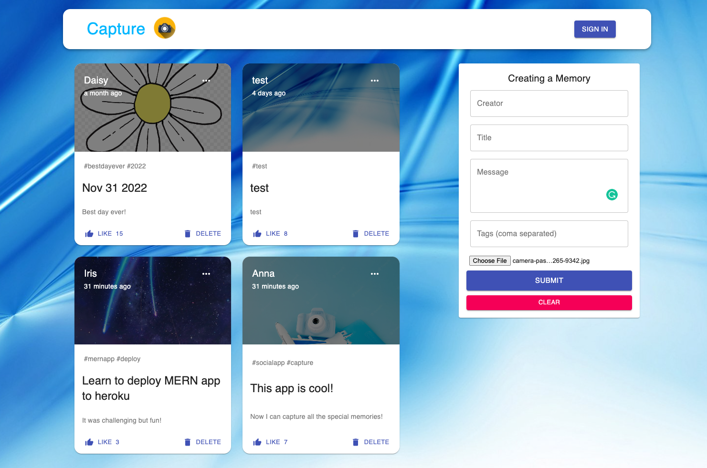

# Capture

## Badges:
---


## Table of Contents:
---
- [Description](#description)
- [Installation](#installation)
- [Usage](#usage)
- [Demo](#demo)
- [Screenshots](#screenshots)
- [License](#license)
- [Questions](#questions)

## Description:
---
A social media MERN application that allows users to capture interesting events that happened in their lives built with React + Redux, Node, Express, MongoDB.

## Installation:
---
To install this app, clone the repo first:
```
git clone git@github.com:daisyle0203/Capture.git
```

## Usage:
---
After you run npm i, you should have all the dependencies that are needed to use the app. In the project directory, you can run:
```
npm start
```
Runs the app in the development mode.
Open http://localhost:3000 to view it in your browser.

The page will reload when you make changes.
You may also see any lint errors in the console.

## Demo :
---
Check out the live application in [Heroku](https://mysterious-mountain-50299.herokuapp.com/).
## Screenshots :
---



## License:
---


## Questions:
---

If you have any questions, you may contact me at either <br>
Github: https://github.com/daisyle0203
<br>
or
<br>
Email: [daisy.le0203@gmail.com](mailto:daisy.le0203@gmail.com)

---

[Top of Page](#capture)